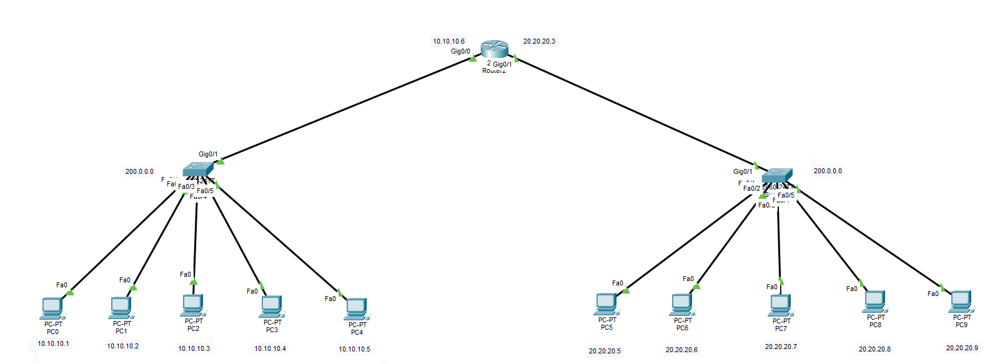

# Cisco Packet Tracer: Dual-Subnet Network Topology

This project demonstrates a fully configured dual-subnet network architecture designed and simulated using **Cisco Packet Tracer**.

## 🌐 Network Overview
The topology consists of a centralized router managing traffic between two distinct Local Area Networks (LANs) via independent switches.

* **Subnet A:** 10.10.10.0/24 (Connected to Switch 1)
* **Subnet B:** 20.20.20.0/24 (Connected to Switch 2)

## 🛠️ Features Implemented
* **Inter-VLAN / Multi-Subnet Routing:** Centralized routing configuration for seamless communication between different subnets.
* **End-to-End Connectivity:** Verified and tested using ICMP ping simulations.
* **Static IP Addressing:** Properly structured IP schema for all end-user devices (PCs) and network interfaces.

## 🚀 How to Run
1. Download the `Project 1.pkt` file from this repository.
2. Open it using **Cisco Packet Tracer** (v8.0 or higher recommended).
3. Switch to **Simulation Mode** or use the **Command Prompt** on any PC to ping across subnets.
